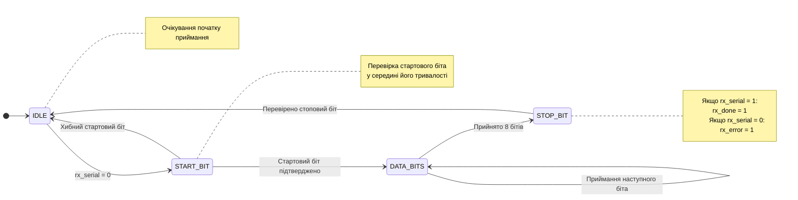

```mermaid
stateDiagram-v2
    direction LR

    [*] --> IDLE

    IDLE --> START_BIT: rx_serial = 0

    START_BIT --> IDLE: Хибний стартовий біт
    START_BIT --> DATA_BITS: Стартовий біт підтверджено

    DATA_BITS --> DATA_BITS: Приймання наступного біта
    DATA_BITS --> STOP_BIT: Прийнято 8 бітів

    STOP_BIT --> IDLE: Перевірено стоповий біт

    note right of IDLE
        Очікування початку приймання
    end note

    note right of START_BIT
        Перевірка стартового біта
        у середині його тривалості
    end note

    note right of STOP_BIT
        Якщо rx_serial = 1:
        rx_done = 1

        Якщо rx_serial = 0:
        rx_error = 1
    end note
```
