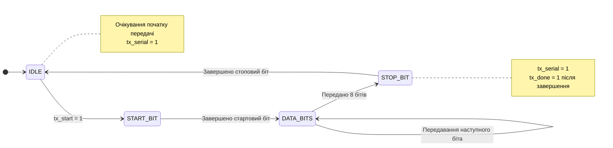

```mermaid
stateDiagram-v2
    direction LR

    [*] --> IDLE

    IDLE --> START_BIT: tx_start = 1

    START_BIT --> DATA_BITS: Завершено стартовий біт

    DATA_BITS --> DATA_BITS: Передавання наступного біта

    DATA_BITS --> STOP_BIT: Передано 8 бітів

    STOP_BIT --> IDLE: Завершено стоповий біт

    note right of IDLE
        Очікування початку передачі
        tx_serial = 1
    end note

    note right of STOP_BIT
        tx_serial = 1
        tx_done = 1 після завершення
    end note
```
